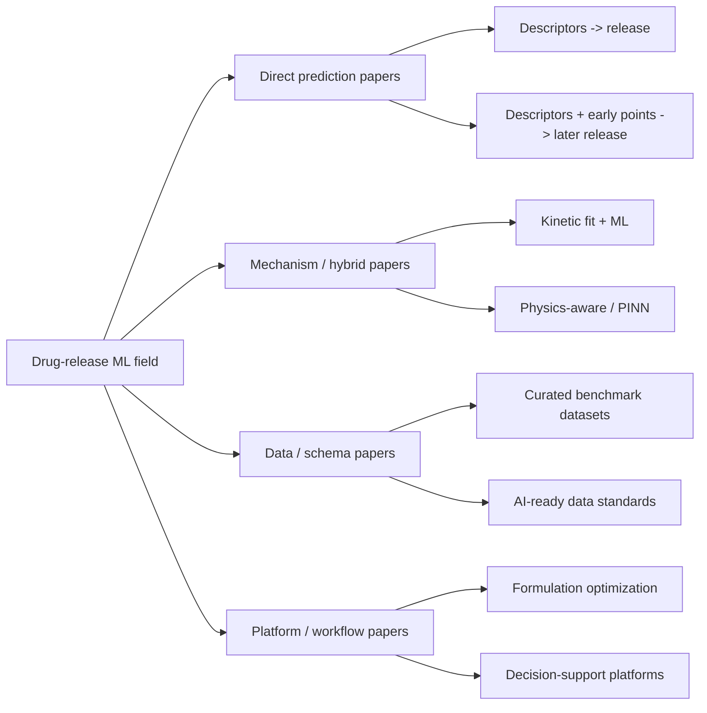

# Drug Release External Field Ledger

Date: `2026-05-29`

Purpose:

```text
Give an evidence-backed answer to:
1. what the external ML + drug-release field is actually doing now,
2. which works are true direct competitors,
3. which works are better treated as borrowable adjacent infrastructure,
4. which journals / venue bands currently host this space.
```

This is a positioning ledger, not a full review article.



## 1. What the field is mostly doing now

The external field is still dominated by four recurring patterns.

1. `tabular descriptors -> release prediction`
2. `tabular descriptors + sparse early observations -> later release`
3. single-mechanism kinetic or hybrid surrogate models
4. data, schema, and workflow infrastructure for formulation AI

Representative evidence:

- Bannigan et al. framed long-acting injectables as a few-shot / zero-shot
  supervised-learning problem in
  [Nature Communications 2023](https://www.nature.com/articles/s41467-022-35343-w).
- A broader formulation-level review already argued in
  [Advanced Drug Delivery Reviews 2021](https://pubmed.ncbi.nlm.nih.gov/34019959/)
  that ML in formulation science is mostly descriptor-driven and workflow-driven.
- A newer field-wide review in
  [Advanced Drug Delivery Reviews 2025](https://www.sciencedirect.com/science/article/pii/S0169409X25002467)
  says the space is expanding, but still from the formulation-ML side rather
  than a unified partially observed dynamics benchmark.
- A release-specific review in
  [Computer Methods and Programs in Biomedicine 2025](https://www.sciencedirect.com/science/article/pii/S0010482525001064)
  summarizes polymeric drug-release prediction as still centered on supervised
  ML models such as ANN, RF, XGBoost, SVM, and related ensembles.

Short verdict:

> the field is growing, but it is still not organized around a shared
> partially observed release-intelligence interface.

That slot remains open.

## 2. Direct competitors

These are the works that most directly compete with the current project.

| Work | Venue | External object | Algorithm style | Why it matters |
|---|---|---|---|---|
| [Bannigan et al. 2023](https://www.nature.com/articles/s41467-022-35343-w) | Nature Communications | few-shot / zero-shot LAI release prediction | tabular ML model zoo; public code favors LGBM for few-shot and RF for zero-shot | direct external benchmark identity |
| [Interpretable Two-Stage ML for PLGA Microspheres 2026](https://www.mdpi.com/1424-8247/19/5/767) | Pharmaceuticals | early + full PLGA release prediction | staged interpretable supervised ML on the 321-curve PLGA dataset | close to our current benchmark and problem phrasing |
| [Polymeric drug-release ML review 2025](https://www.sciencedirect.com/science/article/pii/S0010482525001064) | Computer Methods and Programs in Biomedicine | release prediction survey | ANN / RF / XGBoost / ensemble / SVM | shows what most reviewers will think "standard ML for release" means |

How to position against them:

- They mainly occupy `direct release prediction`.
- Their natural strength is simpler deployment and simpler baselines.
- They do not yet occupy `shared benchmark + posterior-family object + mechanism-specific decoder`.

## 3. Borrowable adjacent work

These works matter, but more as scaffolding or inspiration than as direct
release-performance competitors.

| Work | Venue | Main contribution | Borrow, do not imitate blindly |
|---|---|---|---|
| [Computational pharmaceutics review 2021](https://www.sciencedirect.com/science/article/pii/S0168365921004363) | Advanced Drug Delivery Reviews | formalizes hybrid computation + pharmaceutics workflows | use as umbrella language for mechanism-aware workflow integration |
| [PLGA microparticle dataset 2025](https://pmc.ncbi.nlm.nih.gov/articles/PMC11873201/) | Scientific Data | curated 321-curve PLGA release dataset | use for benchmark legitimacy and dataset provenance |
| [FormulationAI 2023](https://pubmed.ncbi.nlm.nih.gov/37991246/) | Briefings in Bioinformatics | web platform for AI-driven formulation property prediction | borrow decision-support framing, not their broad platform claims |
| [ML-directed formulation development review 2021](https://pubmed.ncbi.nlm.nih.gov/34019959/) | Advanced Drug Delivery Reviews | maps formulation ML across dosage forms | borrow the broader formulation-AI narrative when explaining ambition |
| [PINN drug-release preprint 2026](https://arxiv.org/abs/2602.09963) | arXiv | physics-informed neural-network release modeling | borrow as future hybrid direction; not yet the mainline benchmark standard |

These are valuable because they occupy neighboring layers:

- dataset legitimacy
- formulation AI workflow language
- platform / decision-support framing
- hybrid-model ambition

## 4. What journals / venue bands currently host this space

The field is not concentrated in one single journal lane. It currently spreads
across four venue bands.

### 4.1 Flagship benchmark / cross-disciplinary visibility

- [Nature Communications](https://www.nature.com/articles/s41467-022-35343-w)

This is where a clean benchmark story with broad scientific visibility can
land, especially if the framing is larger than one mechanism or one dosage
form.

### 4.2 Drug-delivery / formulation review venues

- [Advanced Drug Delivery Reviews](https://pubmed.ncbi.nlm.nih.gov/34019959/)
- [Advanced Drug Delivery Reviews 2025 field update](https://www.sciencedirect.com/science/article/pii/S0169409X25002467)

These venues shape the conceptual language of the field, even when they are
not the main outlet for original release benchmarks.

### 4.3 Release / pharmaceutics method venues

- [Computer Methods and Programs in Biomedicine](https://www.sciencedirect.com/science/article/pii/S0010482525001064)
- [Pharmaceuticals](https://www.mdpi.com/1424-8247/19/5/767)

This is where narrower algorithmic or release-prediction method papers are
appearing.

### 4.4 Data and platform venues

- [Scientific Data](https://pmc.ncbi.nlm.nih.gov/articles/PMC11873201/)
- [Briefings in Bioinformatics](https://pubmed.ncbi.nlm.nih.gov/37991246/)

These venues matter because the external field is also competing on data
packaging and workflow value, not just predictive accuracy.

## 5. What this means for us

The external landscape makes three things clear.

### 5.1 The current mainstream is still simpler than our program

Most of the field is still doing:

- `descriptors -> release`
- `descriptors + early release -> later release`
- system-specific prediction

That means our strongest defensible step beyond the field is not "we have a
better regressor", but:

> we are organizing drug release as a shared partially observed inference
> problem with mechanism-specific decoders.

### 5.2 We should treat NC / Bannigan as the direct benchmark rival

That is still the cleanest public competitor for:

- release benchmark identity
- few-shot / zero-shot language
- practical deployment story

### 5.3 We should treat dataset / platform papers as positional borrowing targets

These works matter because they show what the field rewards besides raw
predictive performance:

- curation
- interoperability
- workflow integration
- decision-support packaging

## 6. Bottom line

The external field is active, but still fragmented.

The dominant external patterns are:

1. supervised descriptor-based release prediction
2. early-observation-assisted curve forecasting
3. mechanism-specific surrogate modeling
4. data / platform infrastructure

No current external line clearly owns:

```text
shared benchmark contract
+ shared partially observed release-forecast task
+ shared posterior-family object
+ mechanism-specific decoders
+ shared curve / timescale / uncertainty reporting
```

That is the real opening.

So yes, we can be bolder than a single PLGA paper. But the right boldness is:

> unified drug-release intelligence

not:

> universal solved drug-release model
