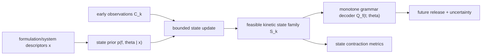

# KGSO: Kinetic Grammar State Observer

这份文档给 Claude 审。

目的不是再找一个更强的黑箱模型，而是把当前分支已经收集出的数据事实组织成一个可审、可实现、可证伪的原创方法方向。

一句话：

```text
释放预测不是普通曲线回归，而是在 sparse early observations 下辨识一个仍然可行的 kinetic state family。
```

建议方法名：

```text
KGSO = Kinetic Grammar State Observer
```

## 0. Workspace Cleanup / Reading Map

当前工作区很吵，不能让审查者从一堆脚本和输出里迷路。

Claude 先读这些，不要先读全仓库：

| Role | Path |
|---|---|
| repo contract | `CLAUDE.md`, `AGENTS.md`, `ARCHITECTURE.md` |
| data closeout | `docs/release_data_collection_closeout_2026-06-03.md` |
| curve-world gate | `docs/curve_world_probe_route_2026-06-02.md` |
| algorithm decision | `docs/algorithm_decision_note_zh_2026-06-03.md` |
| implementation options | `docs/algorithm_implementation_options_2026-06-03.md` |
| clean pool | `outputs/148_release_main_cumulative_v1/` |
| caveat pool | `outputs/149_release_caveat_augmented_cumulative_v1/` |
| hard gate | `outputs/157_curve_world_hard_gate/` |
| frozen theta table | `outputs/158_freeze_theta_targets/` |
| early-observation adapter | `outputs/161_hierarchical_early_obs_adapter/` |

Treat these as noise unless a specific audit requires them:

- old world-model/RSSM branches as headline method
- generic LGBM mapper experiments
- proxy-only corpora mixed into cumulative-release modeling
- historical merged candidate pools before `148/149`
- manuscript prose drafts as evidence

Do not delete or move files just to make the tree pretty. The cleanup here is conceptual: one entry point, one source-of-truth chain, one benchmark lane.

## 1. Current Evidence

The collected data already changes the problem.

### 1.1 Data assets

Clean main pool:

- `outputs/148_release_main_cumulative_v1/`
- `751` curves
- `12,804` release observations
- `751` formulation rows
- `8` component corpora

Caveat sensitivity pool:

- `outputs/149_release_caveat_augmented_cumulative_v1/`
- `784` curves
- `13,153` release observations

Layering rule:

- main experiments use `148`
- sensitivity reruns use `149`
- proxy-only assets stay out of cumulative percent-release targets
- metadata-only assets are descriptor-side only

### 1.2 Shape grammar is thin

`outputs/157_curve_world_hard_gate/summary.md` reports:

- best-family median R2: `0.9949`
- fraction best-family R2 >= 0.95: `0.9547`
- FPCA PC1-3 cumulative explained variance: `0.9892`

Interpretation:

```text
The hard part is not representing Q(t).
The hard part is locating the correct low-dimensional kinetic state from weak descriptors and sparse observations.
```

### 1.3 Current frozen state target

`outputs/158_freeze_theta_targets/summary.md` freezes one shape-family target per curve:

- n_curves: `751`
- n_systems: `8`
- best-family counts:
  - `biexponential`: `337`
  - `weibull`: `297`
  - `hill`: `117`

This is already a usable middle layer:

```text
curve -> family + theta -> Q(t)
```

KGSO should operate on this layer rather than directly regress arbitrary Q(t).

### 1.4 Cross-system transfer is not solved

`outputs/157_curve_world_hard_gate/verdict.json` says:

```text
q1: thin
q2: shared_cross_system_families_present
q3: pooled_transfer_not_helping_even_with_observations
```

This blocks any broad "foundation model already transfers across systems" claim.

The honest claim is narrower:

```text
There is a shared low-dimensional release grammar, but system-conditioned state inference remains the bottleneck.
```

### 1.5 Early observations help, but unevenly

`outputs/161_hierarchical_early_obs_adapter/summary.md` shows that early observations rescue some systems but not all:

- DegraPol: early_obs 0 median R2 `0.5832` -> early_obs 5 median R2 `0.9838`
- collagen-alginate hydrogel: `-2.6810` -> `0.9871`
- PLGA: `-0.2957` -> `0.2623`
- liposome: `-2.4059` -> `-2.1082`
- starch nanoparticle: remains strongly negative

Interpretation:

```text
Early observations are not just extra features.
They are kinetic-identification experiments whose value depends on system, time scale, and family ambiguity.
```

## 2. Core Originality Claim

Do not claim originality from using Weibull, Hill, ridge, CNP, least squares, or monotonic decoders. Those are components.

Claim originality from the object:

```text
KGSO formalizes release forecasting as constrained kinetic-state observation under sparse early measurements.
```

The original contribution has four pieces.

### 2.1 Kinetic grammar

Every cumulative release curve is represented by a compact monotone grammar:

```text
family f in {weibull, biexponential, hill, future extensions}
theta_f = bounded kinetic parameters
Q_f(t; theta_f) = monotone bounded decoder
```

This avoids arbitrary curve regression and turns Q(t) into the output of a legal release state.

### 2.2 Feasible state family, not unique theta

The model should not pretend that one curve identifies one true theta.

Target object:

```text
S(x, C_k) = p(f, theta_f | formulation descriptors x, early context C_k)
```

where:

```text
C_k = {(t_i, Q_i)} for the first k observed release points
```

This is a posterior family / feasible state set, not a single deterministic parameter guess.

### 2.3 State contraction as the value of early observations

Define an explicit state-contraction readout:

```text
SCR(k) = 1 - Volume(S_k) / Volume(S_0)
```

Practical approximations:

- posterior parameter covariance shrinkage
- prediction-band area shrinkage over future times
- entropy reduction over family probabilities
- timescale interval shrinkage for t50/t80

This makes early observations scientifically meaningful:

```text
An early release point is useful if it contracts the feasible kinetic state and improves future prediction/calibration.
```

### 2.4 Future-only prediction

Any prefix-conditioned benchmark must score only future points:

```text
train / condition on t <= t_prefix
score only t > t_prefix
```

Observed early points cannot be counted into R2.

## 3. Method Sketch

### 3.1 Inputs and outputs

Inputs:

- formulation/system descriptors `x`
- observed prefix `C_k = {(t_i, Q_i)}`
- target query times `T_future`

Outputs:

- family probabilities `p(f | x, C_k)`
- feasible parameter posterior or sample set `p(theta_f | f, x, C_k)`
- future predictive mean `E[Q(t) | x, C_k]`
- uncertainty bands
- state-contraction diagnostics

### 3.2 Minimal KGSO v0

KGSO v0 should be dependency-light and built from existing assets.

```text
1. Fit or load frozen family targets from outputs/158.
2. Train a descriptor/system prior over family + theta.
3. Given early observations, update theta by bounded MAP:

   minimize_theta:
       data_loss(Q_f(t_obs; theta), Q_obs)
       + lambda * prior_distance(theta, theta_prior)

4. Decode future curve through Q_f(t; theta).
5. Score only future observations.
6. Report prediction and state-contraction metrics.
```

This is not yet the neural version. It is the interpretable anchor.

### 3.3 KGSO v1: amortized observer

If v0 proves the object is useful, v1 amortizes the update:

```text
encoder_context(C_k, x) -> posterior parameters over family/theta
```

Possible borrowed engines:

- CNP / Neural Process for sparse context sets
- Neural CDE for irregular prefix encoding
- UMNN or lattice model only if direct-Q monotonic baseline is needed

Constraint:

```text
The neural module may infer the state distribution, but Q(t) still passes through a monotone grammar decoder.
```

Do not let v1 collapse into a generic sequence-to-curve black box.

### 3.4 Diagram



## 4. Benchmark Plan

### Lane 0: Reproduce existing anchors

Purpose:

- confirm the workspace is being read correctly
- avoid inventing numbers

Required anchors:

- `outputs/148_release_main_cumulative_v1/manifest.json`
- `outputs/157_curve_world_hard_gate/verdict.json`
- `outputs/158_freeze_theta_targets/summary.md`
- `outputs/161_hierarchical_early_obs_adapter/system_summary.csv`

Success:

- local summary script reproduces the same curve counts and system counts
- no new modeling yet

### Lane A: Descriptor-only state prior

Question:

```text
How far can x alone locate family/theta?
```

Baselines:

- system median family/theta
- ridge over descriptors
- tree/ExtraTrees over theta targets
- direct-Q baseline from existing canonical lanes

Metrics:

- per-curve future/all-point R2
- RMSE/MAE
- family accuracy / NLL if probabilistic
- parameter error only as diagnostic, not headline truth

Expected result:

- descriptor-only remains limited, especially cross-system

### Lane B: Early-prefix KGSO future forecasting

Question:

```text
Does C_k contract kinetic state and improve future prediction?
```

Evaluate k values:

- `0`
- `1`
- `3`
- `5`
- optionally time-window prefixes such as first 1 day / 3 days / 7 days

Score only:

```text
t > max observed prefix time
```

Baselines:

- no-prefix descriptor prior
- last-value hold
- descriptor prior + simple shift
- existing `161_hierarchical_early_obs_adapter`
- direct-Q prefix baseline if available

KGSO must show:

- better future prediction
- lower failure tail
- uncertainty remains calibrated
- state contraction correlates with prediction improvement

### Lane C: Leave-one-system-out

Question:

```text
Does the observer transfer across material systems?
```

Use systems from `outputs/158`:

- Alginate microbead
- DegraPol mesh
- PLGA
- collagen-alginate hydrogel
- golf ball-shaped microsphere
- liposome
- sodium caseinate film
- starch nanoparticle

Expected risk:

- current evidence says pooled transfer is not helping globally

Allowed claim if weak:

```text
KGSO exposes which systems share kinetic grammar and which require local priors.
```

Not allowed:

```text
Universal cross-system foundation model is solved.
```

### Lane D: Main vs caveat sensitivity

Primary:

- `outputs/148_release_main_cumulative_v1/`

Sensitivity only:

- `outputs/149_release_caveat_augmented_cumulative_v1/`

Rule:

```text
No conclusion is headline if it only appears after caveat-pool augmentation.
```

### Lane E: PLGA-specific bridge

For PLGA, compare KGSO against the earlier PLGA route:

- descriptor-only PLGA bridge
- early-observation bridge
- grouped/sibling-safe splits
- MEP / DirectQ / isotonic black-box baselines where appropriate

Purpose:

- show whether KGSO explains why static descriptor models hit a ceiling
- avoid pretending the multi-system pool automatically solves PLGA external generalization

## 5. Metrics

Prediction metrics:

- median per-curve future R2
- pooled future R2
- RMSE / MAE
- bad-tail fraction, e.g. R2 < 0
- monotonicity violations

Uncertainty metrics:

- 50% and 90% coverage
- interval width
- width-for-coverage efficiency

State metrics:

- family entropy before/after prefix
- posterior covariance shrinkage
- prediction-band area shrinkage
- t50/t80 interval shrinkage
- state-contraction ratio

Mechanistic/diagnostic metrics:

- system-wise family distribution
- prefix value by system
- transfer win fraction
- failure taxonomy by system and time scale

## 6. Implementation Plan

### Phase 0: Freeze workspace entry points

Create no new data sources.

Use:

- `148` as main pool
- `149` as caveat pool
- `158` as frozen target table
- `80_release_partial_observation_benchmark.py` as shared evaluation layer where possible
- `161` as the immediate baseline to beat or explain

Deliverable:

- one manifest-like note listing the exact files consumed
- one reproducibility command per benchmark

### Phase 1: KGSO v0, non-neural

Implement the smallest object:

```text
system/descriptor prior -> bounded MAP prefix update -> monotone grammar decoder
```

Do not add dependencies.

Do not modify simulator or ARCHITECTURE.

Deliverables:

- per-curve predictions
- future-only metrics
- state-contraction table
- system summary

Kill criteria:

- KGSO v0 does not beat simple prior+shift on future prediction
- contraction metrics do not correlate with improvement
- calibration is worse than naive width baselines

### Phase 2: Unified benchmark wrapper

Route KGSO predictions into the existing partial-observation benchmark schema.

Deliverables:

- `predictions.csv` compatible with `80_release_partial_observation_benchmark.py`
- `metrics_summary.csv`
- `metrics_by_curve.csv`
- `uq_summary.csv` if uncertainty is included

Kill criteria:

- results change materially when evaluated by the shared benchmark
- prefix points accidentally enter scored targets

### Phase 3: KGSO v1, amortized observer

Only start if v0 shows real object value.

Possible route:

```text
CNP-style context encoder -> distribution over grammar state -> monotone decoder
```

Borrow from existing Neural Process codebases, but keep the decoder local and constrained.

Kill criteria:

- neural observer improves median but worsens failure tail
- loses calibration
- does not beat v0 enough to justify complexity

### Phase 4: Paper evidence pack

Figures:

1. corpus/grammar evidence: low-dimensional grammar explains curves
2. state uncertainty before/after early observations
3. future-only prediction improvement by k
4. system-wise transfer/failure map
5. caveat-pool sensitivity

Claims:

- allowed:
  - release curves share a compact kinetic grammar
  - descriptor-only state inference is the bottleneck
  - sparse early observations contract feasible kinetic states
  - KGSO gives an interpretable observer over legal monotone release states
- banned:
  - universal foundation model solved
  - cross-system transfer solved
  - early observations always help
  - direct-Q black box is mechanistically explained

## 7. Claude Review Questions

Claude should attack these points first:

1. Is KGSO genuinely a method object, or still a stitched pipeline?
2. Are the originality claims separable from borrowed components?
3. Is the prefix benchmark future-only everywhere?
4. Are main and caveat pools kept separate?
5. Does any route accidentally learn from test-curve fitted theta?
6. Is the descriptor prior evaluated under the correct split?
7. Are bad-tail and calibration reported, not just median R2?
8. Does state contraction predict future improvement, or is it decorative?
9. Does liposome/starch failure falsify the broad claim?
10. What is the smallest baseline that would embarrass KGSO?

## 8. Hard No List For This Plan

Do not:

- call KGSO a world model
- call PAVA/isotonic repair the algorithm
- mix proxy release signals into cumulative percent-release targets
- count observed prefix points in prediction metrics
- use random splits as headline evidence
- add new public datasets before testing the current 751-curve pool
- resurrect LightGBM mapper as the main method
- use caveat-pool wins as primary evidence
- edit `ARCHITECTURE.md` to fit this plan
- add dependencies before v0 proves the object is useful

## 9. One-Sentence Paper Spine

```text
Across 751 standardized release curves, cumulative drug release admits a compact monotone kinetic grammar; the remaining challenge is not curve representation but sparse kinetic-state identification, which KGSO addresses by updating a feasible family of release states from formulation descriptors and early observations before decoding future release through legal monotone dynamics.
```

## 10. Immediate Next Action

Run a v0 KGSO audit, not a new model zoo.

Minimum first deliverable:

```text
For each curve in the clean pool:
    prior state from system/descriptor information
    posterior state after k = 0, 1, 3, 5 early observations
    future-only prediction metrics
    state-contraction metrics
    system-wise failure analysis
```

If that result is weak, the project still gains a clean negative:

```text
The corpus has a compact release grammar, but sparse early observations do not universally identify cross-system kinetic states.
```

That is scientifically useful and safer than another overclaimed black-box win.
