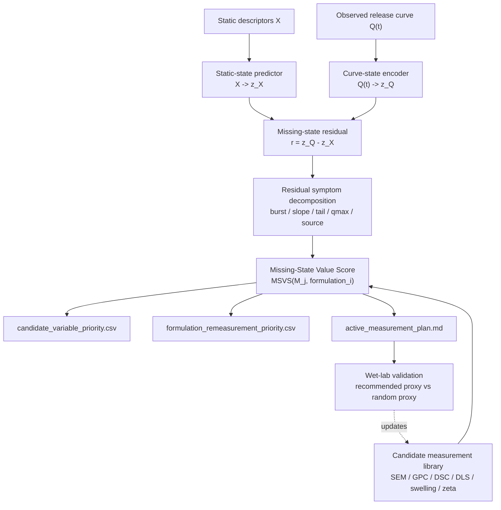

# Release-State Forensics Algorithm Framework Plan

Date: 2026-06-13

Status: planning document for external model critique and later `/goal` design.

## Dependency On Release-State Formalism

RSF is an application layer, not the mathematical foundation.

Before implementing RSF/MSVS, scripts `120+` must obey the formal contract in:

```text
docs/release_state_inference_formalism_2026-06-13.md
release_state.py
```

This means:

```text
Q(t) -> z_Q
X -> z_X
r = d_c(z_Q, z_X)
```

is valid only inside one declared `ReleaseStateSpace`.

For PCA, NMF, spline, or dictionary spaces, residual dimensions do not receive
direct physical names. They become symptoms only after decoding the residual
back into time-domain perturbations such as burst, slope, tail, qmax, or t50.

For Weibull, Hill, or ODE theta spaces, residuals must use their natural
coordinate system, such as log-theta or log-ratio residuals.

Practical boundary:

```text
120 = same-space residual map
121 = candidate measurement scoring / MSVS
122 = active remeasurement planner
```

MSVS must not appear inside 120.

## One-Sentence Positioning

Release-State Forensics, abbreviated as RSF, is not another drug-release
curve predictor.

It is a missing-state discovery framework:

```text
when static formulation descriptors fail to predict release,
RSF identifies the release-state residual and recommends
which material, microstructure, process, or assay measurements
should be collected next.
```

Chinese positioning:

```text
药物释放隐藏状态取证算法：
不只是预测释放曲线，而是在预测失败时定位缺失状态，并推荐最值得补测的表征变量和处方样本。
```

## Why This Route Exists

The project has already produced a clear information-structure pattern:

```text
static X alone is often insufficient;
early Q(t) carries release-state information;
synthetic hidden-state omission can reproduce static-X failure;
real 321 PLGA curves show proxy structure after H_like projection,
but current synthetic support is too narrow for physical validation.
```

The next original algorithm should therefore not be:

```text
a stronger black-box release predictor
```

It should be:

```text
a residual-forensics and measurement-recommendation algorithm
```

The central question becomes:

```text
When prediction fails, what missing state should be measured next?
```

## Current Evidence Anchors

### PLGA Information Budget

Real PLGA evidence supports:

```text
static formulation descriptors under-identify release;
measured early Q(t) exposes missing release state.
```

Interpretation:

```text
early Q(t) is not an ordinary feature;
it is an empirical release-state measurement.
```

### Liposome Second-System Evidence

Liposome evidence supports:

```text
curve representation can be strong;
static X -> z remains weak under strict transfer;
RDKit / PubChem descriptors do not close the strict API gap.
```

Interpretation:

```text
missing state is likely process, microstructure, assay, or source state,
not only molecular descriptors.
```

### 118 Synthetic Hidden-State Audit

118 shows in a known-ground-truth synthetic world:

```text
reported_X RMSE = 0.0748
reported_X + true H RMSE = 0.0470
reported_X + noisy proxy H RMSE = 0.0620
early Q k=3 closes 94.3% of the hidden-state gap
hidden_strength increases reported_X-to-true_H gap
```

Interpretation boundary:

```text
118 proves omitted hidden state is sufficient to cause the observed failure mode.
It does not prove real PLGA is controlled by the synthetic H variables.
```

### 119 Real 321 PLGA Projection Bridge

119 projects real 321 PLGA curves into simulation-informed H_like coordinates:

```text
full_Q -> H_like inversion R2 = 0.322
real curves loaded = 321
projectable curves = 128
proxy associations exceeding shuffle null = 103
DOI / method hits = 25
fraction_flagged_ood = 0.914
```

Interpretation boundary:

```text
119 supports proxy-aligned release-state structure,
but high OOD coverage means it is a hypothesis-generating bridge,
not validation of the synthetic simulator or physical hidden variables.
```

## Core Conceptual Shift

Traditional task:

```text
X -> Q(t)
```

RSF task:

```text
Q(t) -> z_Q
X -> z_X
r = d_c(z_Q, z_X)
r -> missing-state symptoms
symptoms + candidate library -> measurement recommendations
```

The algorithm is not searching for the best model.

It searches over:

```text
candidate measurement library
× residual symptom space
× formulation set
```

Output is not a single predicted curve.

Output is:

```text
what to measure,
why to measure it,
and on which formulations first.
```

## System Diagram



## Core Objects

### 1. Curve-State Representation

Each release curve is represented as a state vector:

```text
Q(t) -> z_Q
```

Use multiple representations instead of betting on one:

```text
PCA curve embedding
Weibull theta
Hill theta
biexponential theta
dictionary / spline state
H_like projection from 119
early-Q state descriptors
```

Reason:

```text
If the residual only appears in one representation, it may be representation artifact.
If it appears across several, it is more likely real missing release-state information.
```

### 2. Static-State Predictor

Static descriptors predict the curve state:

```text
X -> z_X
```

Models should stay boring in v1:

```text
Ridge
ExtraTrees
RandomForest
KNN baseline
```

No KAN, LNN, PINN, RSSM, or generic neural architecture unless a later
diagnostic shows which RSF gap the neural model closes.

### 3. Missing-State Residual

Core definition:

```text
r = d_c(z_Q, z_X)
```

The scalar score:

```text
missing_state_score = ||r||
```

But the useful object is not only the norm.

The residual must be decomposed into symptoms:

```text
burst_residual
early_slope_residual
middle_diffusion_residual
late_tail_residual
qmax_residual
t50_residual
curvature_residual
source_or_method_residual
```

For data-driven state spaces, symptoms are decoded curve perturbations rather
than raw component names. For example, a PCA residual can be called an early
burst symptom only if its decoded perturbation changes early release.

### 4. Candidate Measurement Library

The candidate library defines the search space. It is not a passive list of
features.

Each candidate measurement must include:

```text
candidate_variable
measurement_method
cost_level
destructiveness
sample_amount_needed
expected_release_state
expected_curve_signature
available_proxy_columns
risk_of_source_confounding
```

Example rows:

| Candidate | Method | Expected State | Curve Signature | Cost |
|---|---|---|---|---|
| surface_drug_fraction | surface wash / XPS / ToF-SIMS | surface reservoir | high burst residual | high |
| particle_size_cv | DLS / laser diffraction | size heterogeneity | burst and slope variance | low |
| SEM_porosity_score | SEM image analysis | pore/channel morphology | middle diffusion residual | medium |
| GPC_Mw_Mn_PDI | GPC before/after release | degradation / MW distribution | late acceleration or tail residual | medium |
| DSC_Tg | DSC | matrix mobility | diffusion and qmax residual | medium |
| swelling_ratio | gravimetric swelling | water uptake | faster diffusion and earlier t50 | low |
| residual_solvent | GC | plasticization / morphology | burst and middle diffusion residual | high |
| zeta_potential | zeta analyzer | surface state | surface/assay/source residual | low |

## Mechanistic Signature Matrix

The most important nontrivial object is:

```text
candidate measurement -> expected residual symptom signature
```

This is what prevents RSF from becoming a vague "correlation ranking" tool.

Example:

| Candidate | Burst | Early Slope | Middle Diffusion | Late Tail | Qmax | Source Risk |
|---|---:|---:|---:|---:|---:|---:|
| surface_drug_fraction | high | medium | low | low | low | medium |
| particle_size_cv | medium | high | medium | low | low | low |
| SEM_porosity_score | medium | medium | high | medium | low | medium |
| GPC_Mw_Mn_PDI | low | low | medium | high | medium | low |
| DSC_Tg | low | medium | medium | medium | high | medium |
| swelling_ratio | low | medium | high | medium | medium | low |
| residual_solvent | high | high | medium | low | low | high |
| drug_polymer_miscibility | low | medium | medium | medium | high | medium |

The matrix can begin as expert prior, then be updated by:

```text
existing table proxies
real residual associations
wet-lab validation
negative controls
```

## Missing-State Value Score

The proposed scoring function:

```text
MSVS(M_j, i)
= residual_signature_match(M_j, i)
+ observed_proxy_support(M_j)
+ prediction_gain_if_proxy_available(M_j)
+ cross_source_stability(M_j)
+ nonredundancy(M_j)
- measurement_cost_penalty(M_j)
- source_confound_penalty(M_j)
```

Where:

```text
M_j = candidate measurement
i   = formulation / curve
```

### Component 1: Residual Signature Match

Question:

```text
Does formulation i fail in the way candidate measurement M_j is expected to explain?
```

Example:

```text
high burst residual
-> surface_drug_fraction, residual_solvent, particle_size_cv receive high prior score
```

### Component 2: Observed Proxy Support

Question:

```text
Do available proxies related to M_j explain the residual beyond shuffle null?
```

Examples:

```text
Particle Size -> residual symptoms
Drug Loading Capacity -> burst residual
Formulation Method -> process residual
DOI -> source residual
```

### Component 3: Prediction Gain If Proxy Available

Question:

```text
When a proxy is already available, does X + proxy improve z_Q or future Q prediction?
```

This prevents recommending variables that correlate with residual but do not
improve useful prediction.

### Component 4: Cross-Source Stability

Question:

```text
Does the proxy/residual relationship persist under DOI, method, drug, or source split?
```

If it only works inside one DOI, it may be a source artifact.

### Component 5: Nonredundancy

Question:

```text
Does M_j add information beyond existing X and other cheaper proxies?
```

This prevents recommending expensive measurements that duplicate cheap ones.

### Component 6: Cost And Confounding Penalty

Cost should be explicit:

```text
low    = DLS, zeta, swelling, EE/DL
medium = SEM, GPC, DSC, degradation mass loss
high   = GC residual solvent, XPS, ToF-SIMS, micro-CT
```

Confounding penalty should also be explicit:

```text
DOI-only effect
method-only effect
assay/source effect
missingness correlated with source
```

## Variable-Formulation Pair Search

RSF should not only rank variables.

It should rank pairs:

```text
(candidate measurement, formulation subset)
```

Example output:

```text
Formulation 37:
  residual symptom = high burst residual
  recommended measurements = surface_drug_fraction, particle_size_cv
  reason = early release exceeds static prediction; loading/method proxies align

Formulation 104:
  residual symptom = late tail residual
  recommended measurements = GPC_Mw_Mn_PDI, degradation_mass_loss
  reason = late acceleration not explained by X; degradation-like signature

Formulation 188:
  residual symptom = high residual but extreme OOD
  recommended action = inspect source/curve quality before new measurements
```

## Candidate Output Tables

### `curve_state_table.csv`

```text
curve_id
DOI
Drug
Formulation Method
z_Q_pca_*
z_Q_weibull_*
z_Q_hill_*
z_Q_Hlike_*
curve_quality_flag
max_time
n_timepoints
```

### `missing_state_residuals.csv`

```text
curve_id
DOI
Drug
Formulation Method
residual_norm
burst_residual
early_slope_residual
middle_diffusion_residual
late_tail_residual
qmax_residual
source_or_method_residual
static_predictable_fraction
```

### `candidate_measurement_library.csv`

```text
candidate_variable
measurement_method
cost_level
destructiveness
expected_release_state
expected_curve_signature
available_proxy_columns
```

### `candidate_signature_matrix.csv`

```text
candidate_variable
burst_signature_weight
early_slope_signature_weight
middle_diffusion_signature_weight
late_tail_signature_weight
qmax_signature_weight
source_confound_risk
```

### `candidate_variable_priority.csv`

```text
candidate_variable
MSVS
residual_signature_match
observed_proxy_support
prediction_gain
cross_source_stability
nonredundancy
measurement_cost_penalty
interpretation
```

### `formulation_remeasurement_priority.csv`

```text
curve_id
DOI
Drug
Formulation Method
missing_state_score
dominant_residual_symptom
recommended_measurements
representativeness_score
OOD_flag
remeasurement_priority
```

## Planned Experiment Chain

### 120: Missing-State Residual Map

Goal:

```text
Q(t) -> z_Q
X -> z_X
r = d_c(z_Q, z_X)
```

Outputs:

```text
curve_state_table.csv
static_state_prediction.csv
missing_state_residuals.csv
residual_symptom_summary.csv
decision_table.csv
report.md
```

Primary decision rows:

```text
does Q-derived state contain information beyond static X?
are residuals stable under strict split?
which residual symptoms dominate?
are high-residual curves source artifacts or mechanistic candidates?
```

Explicit exclusion:

```text
No MSVS.
No candidate measurement ranking.
No claim that PCA component residuals are physical variables.
```

### 121: Candidate Measurement Value Scoring

Goal:

```text
score candidate measurements by residual explanation,
prediction gain, stability, nonredundancy, and cost
```

Outputs:

```text
candidate_measurement_library.csv
candidate_signature_matrix.csv
candidate_variable_priority.csv
proxy_validation_summary.csv
decision_table.csv
report.md
```

Primary decision rows:

```text
do existing table proxies explain residual beyond shuffle null?
which candidate measurement families have strongest value/cost ratio?
does any candidate survive DOI/method split?
```

### 122: Active Remeasurement Planner

Goal:

```text
recommend variable-formulation pairs under measurement budget
```

Outputs:

```text
formulation_remeasurement_priority.csv
active_measurement_plan.md
measurement_budget_scenarios.csv
decision_table.csv
report.md
```

Primary decision rows:

```text
which formulations should be remeasured first?
which measurements should be bundled?
which candidates are too OOD or too source-confounded?
```

### 123: HA/PVP Wet-Lab Missing-State Validation

Goal:

```text
test whether RSF-recommended proxies improve prediction or residual explanation
in a controlled wet-lab system
```

Comparison:

```text
X only
X + recommended proxy
X + random proxy
X + early Q
X + recommended proxy + early Q
```

Success pattern:

```text
X + recommended proxy > X + random proxy > X only
```

## Evaluation Logic

RSF can produce three useful outcomes.

### Outcome A: Existing Proxies Explain Residual

Interpretation:

```text
public PLGA tables already contain weak hidden-state proxies;
RSF can prioritize them and guide future measurement.
```

### Outcome B: Only DOI / Method Explains Residual

Interpretation:

```text
missing state is dominated by source, process, assay, or batch variables;
more static molecular descriptors will not solve the problem.
```

### Outcome C: Existing Proxies Explain Little

Interpretation:

```text
available table-level proxies are insufficient;
targeted SEM, GPC, DSC, swelling, degradation, or surface-state measurements
are necessary.
```

None of these outcomes is a failure if reported honestly.

## Attack Surface For External Model Review

Ask other models to attack these points:

1. Is RSF genuinely different from feature selection or active learning?
2. Is the residual definition representation-dependent?
3. Does the candidate signature matrix encode too much subjective prior?
4. Can source/DOI confounding masquerade as missing state?
5. Does MSVS recommend measurements that improve prediction, or only explain
   residual post hoc?
6. Are measurement costs realistic?
7. Can the framework produce useful recommendations when no proxy is currently
   measured?
8. What negative controls are mandatory?
9. How should RSF handle high-OOD real curves like the 119 result?
10. What would falsify the framework?

## Non-Negotiable Negative Controls

Every RSF experiment must include:

```text
shuffled proxy labels
shuffled DOI/method labels
random candidate measurement
random rotated curve-state basis
X-only residual baseline
source-only baseline
representation sensitivity
cost-free oracle proxy when available
```

## Forbidden Claims

Do not claim:

```text
RSF discovered real porosity.
RSF proved tortuosity controls PLGA release.
H_like equals physical hidden state.
The synthetic hidden variables were validated in real PLGA.
Prediction failure is solved.
```

Allowed claims:

```text
RSF identifies release-state residuals not explained by reported descriptors.
RSF prioritizes candidate measurements expected to reduce those residuals.
RSF turns prediction failure into a measurement-design problem.
RSF generates testable missing-state hypotheses.
```

## Strongest Manuscript Framing

English:

```text
We propose Release-State Forensics, a missing-state discovery framework for
drug release prediction. Instead of treating prediction failure as a
model-selection problem, RSF identifies the release-state residual not
explained by reported static descriptors, decomposes it into kinetic symptoms,
and ranks material/process measurements by expected value under measurement
cost.
```

Chinese:

```text
我们提出药物释放隐藏状态取证框架。该框架不再把预测失败简单归因于模型选择，
而是识别静态描述符无法解释的释放状态残差，将其分解为动力学症状，并在测量
成本约束下推荐最有信息价值的材料或工艺表征。
```

## Current Best Judgment

The original algorithm should not be a new neural architecture.

The original algorithm should be:

```text
residual -> symptom -> candidate measurement -> variable-formulation priority
```

This is the route that can convert the project's apparent failures into a
coherent scientific contribution:

```text
static prediction failure becomes evidence of missing state;
early Q becomes empirical state observation;
proxy alignment becomes partial state validation;
OOD coverage becomes a warning about simulator support;
measurement recommendation becomes the actionable output.
```
