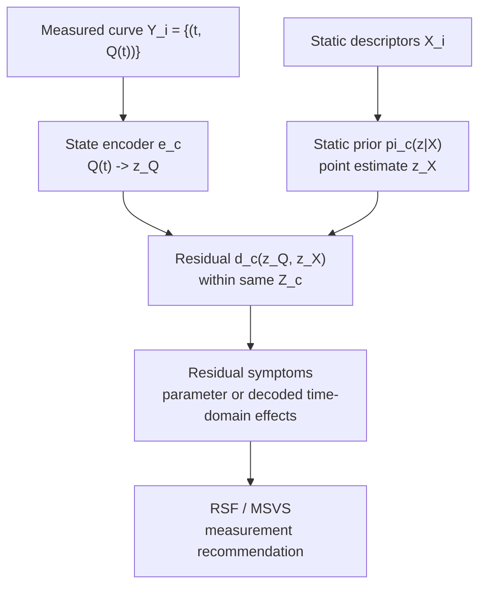

# Release State Inference Formalism

Date: 2026-06-13

Status: mathematical contract for scripts `120+` and for the RSF/MSVS route.

## Purpose

This document defines the formal objects that must exist before Release-State
Forensics can be implemented cleanly.

RSF is an application-layer algorithm:

```text
residual -> symptom -> candidate measurement -> measurement recommendation
```

It depends on a lower-level inference formalism:

```text
Q(t) -> z_Q
z -> Q(t)
X -> prior(z)
X + Y_k -> updated state
r = z_Q - z_X or d_Z(z_Q, z_X)
```

Without this layer, each PLGA, liposome, hydrogel, or future-system experiment
will re-define curve states, priors, residuals, and symptoms inside one-off
scripts. That is exactly the pattern the project must stop repeating.

## Definitions

### Definition 1: Release State Space

For a carrier or release system `c`, a release state space is:

```text
S_c = (Z_c, e_c, g_c, d_c)
```

where:

```text
Z_c      = state space for release system c
e_c      = encoder, Q(t) -> z_Q
g_c      = decoder, z and t -> Q_hat(t)
d_c      = natural residual / distance on Z_c
```

The decoder:

```text
g_c: Z_c x T -> [0, 1]
```

The observed curve is:

```text
Q_i(t) = g_c(z_i, t) + epsilon_i(t)
```

Examples:

| State space | z | decode g_c | natural residual |
|---|---|---|---|
| PCA curve dictionary | PCA coefficients | inverse PCA on common grid | Euclidean difference |
| Weibull | log tau, log beta, logit qmax | Weibull curve | log-parameter difference |
| Hill | log t50, log n, logit qmax | Hill curve | log-parameter difference |
| PLGA ODE | log kinetic theta | ODE rollout | log-ratio residual |
| H_like synthetic state | simulation-informed coordinates | learned/implicit projection | bounded-coordinate difference |

### Definition 2: Curve-Derived State

Given a measured release curve:

```text
Y_i = {(t_ij, Q_i(t_ij))}
```

the curve-derived state is:

```text
z_Q,i = e_c(Y_i)
```

This is an observed-state estimate. It may be a PCA coefficient vector, a fitted
shape-family parameter vector, an ODE inversion, or a simulation-aligned
coordinate. It is not automatically a physical hidden variable.

### Definition 3: Static Prior

Static descriptors define a prior or point estimate over release state:

```text
pi_c(z | X_i)
```

The simplest implementation estimates the posterior mean:

```text
z_X,i = E[z | X_i]
```

Tree regressors, ridge models, nearest-neighbor models, SBI posteriors, and
conformal ensembles are all implementations of this same object. They are not
separate research directions unless they close a documented gap in this
formalism.

### Definition 4: Observation Update

Early release observations are:

```text
Y_i,k = {(t_ij, Q_i(t_ij))}_{j=1}^k
```

They update the static prior:

```text
pi_c(z | X_i, Y_i,k)
```

The point-estimate version is:

```text
z_XY,i,k = E[z | X_i, Y_i,k]
```

This covers early-Q adapters, theta updates, CNP/LNN-style sequence updates,
particle observers, and any future posterior method. The method is only useful
if it improves a formally defined state or decision objective.

### Definition 4.5: Representation Agreement

Script 120 will evaluate more than one release state space. This is allowed
only as a sensitivity check, not as permission to subtract states across
representations.

For two fitted state spaces `S_a` and `S_b`, define residual norms per curve:

```text
m_a,i = ||d_a(z_Q,a,i, z_X,a,i)||
m_b,i = ||d_b(z_Q,b,i, z_X,b,i)||
```

The primary representation-agreement statistic is:

```text
concordance(S_a, S_b) = SpearmanRankCorr({m_a,i}, {m_b,i})
```

A high-residual set is defined by a train-fold threshold, for example the
train-fold `q80` of residual norms:

```text
H_a = {i : m_a,i > threshold_a}
H_b = {i : m_b,i > threshold_b}
```

The secondary agreement statistic is:

```text
high_residual_overlap(S_a, S_b) = Jaccard(H_a, H_b)
```

Interpretation:

```text
stable residual = high residual norm or symptom appears across representations
representation artifact = residual appears only in one state space
```

`representation_agreement.csv` in script 120 should report at least residual
norm rank correlation and high-residual overlap across state spaces.

### Definition 5: Information Value

For an evaluation loss `L`, observation-budget value is:

```text
V(k) = L(pi_c(z | X)) - L(pi_c(z | X, Y_k))
```

The marginal value of one more observation is:

```text
Delta V(k+1) = V(k+1) - V(k)
```

A stopping rule can be written as:

```text
choose smallest k such that Delta V(k+1) < cost(k+1)
```

This is the formal version of the information-budget story:

```text
early Q is valuable only when it reduces state uncertainty or future prediction risk
more than its measurement cost.
```

Default loss:

```text
L_z(pi) = E_i[||z_Q,i - E[z | input_i]||_2^2]^(1/2)
```

This is the primary state-space RMSE. Decoded curve RMSE is a derived loss:

```text
L_Q(pi) = E_i,t[(g_c(E[z | input_i], t) - Q_i(t))^2]^(1/2)
```

For script 120, `L_z` is the default residual objective. `L_Q` is reported as
the curve-domain consequence of the same state estimate, not as a separate
definition of state.

### Definition 6: Missing-State Residual

For a fixed state space `S_c`, define:

```text
r_i = d_c(z_Q,i, z_X,i)
```

If `Z_c` is Euclidean:

```text
r_i = z_Q,i - z_X,i
```

If `Z_c` is log-parameterized:

```text
r_i = log(z_Q,i) - log(z_X,i)
```

If `Z_c` is not naturally subtractive:

```text
r_i = metric or transport residual in Z_c
```

Hard rule:

```text
Do not subtract states from different spaces.
```

For example:

```text
PCA coefficient residuals and ODE theta residuals are not directly comparable
unless projected through a shared metric or decoded into curve space.
```

### Definition 7: Residual Symptom

A residual symptom is an interpretable projection of missing-state residual
into curve or state behavior.

There are two modes.

Mode A: interpretable state space.

```text
Weibull / Hill / ODE theta residuals can be mapped to named parameter symptoms:
scale residual, shape residual, qmax residual, burst residual, degradation residual.
```

Mode B: data-driven state space.

```text
PCA / NMF / dictionary residuals do not have intrinsic physical names.
Their symptoms must be assigned by decoding perturbations back to time-domain
curve effects.
```

Example:

```text
If PC2 perturbation primarily changes early Q(t), then PC2 residual can be
labeled an early/burst-like symptom for that trained fold.
```

Symptom labels are therefore derived objects, not arbitrary dimension names.

## Formal Pipeline



## Interface Contract

The code implementation should expose these objects:

```text
ReleaseStateSpace
  encode(curves, times) -> z_Q
  decode(z, times) -> Q_hat
  residual(z_Q, z_X) -> r
  symptom_loadings(times) -> optional time-domain interpretation

StaticPrior
  fit(X, z)
  predict(X) -> z_X

ObservationUpdater
  fit(X, Y_k, z)
  predict(X, Y_k) -> z_XY

ObservationBudgetAnalyzer
  value_curve(...)
```

Current implementation assumption:

```text
curves is an n_curves x n_timepoints matrix
times is one shared 1D time grid
```

Therefore ragged real release curves must be interpolated or otherwise encoded
onto a shared grid before entering the current `ReleaseStateSpace` interface.
PCA/NMF/dictionary spaces require this. Weibull/Hill-style per-curve encoders
can later support ragged input, but that must be exposed as an explicit
interface extension rather than silently overloading `times`.

The first implementation can stay minimal:

```text
PCACurveStateSpace
WeibullStateSpace
TreePrior
```

The formalism is more important than model sophistication.

## Relationship To RSF/MSVS

Release State Inference is the foundation.

RSF/MSVS is an application:

```text
Release State Inference:
  defines z_Q, z_X, residuals, and symptoms.

RSF/MSVS:
  uses those residuals and symptoms to rank candidate measurements.
```

Therefore:

```text
120 should map residuals.
121 should score candidate measurements.
122 should recommend variable-formulation pairs.
123 should test the recommendation in wet-lab data.
```

MSVS should not be implemented inside 120. Otherwise 120 becomes another
overgrown script and repeats the branching problem.

## Required Constraints For Script 120

Script 120 must obey:

```text
sample unit is one curve
state representation is fit on train folds only
z_Q and z_X are compared only within the same ReleaseStateSpace
PCA/NMF/dictionary labels are decoded before symptom naming
random curve/timepoint split is not a headline result
proxy scoring is not part of 120
```

Script 120 should output:

```text
curve_state_table.csv
static_state_prediction.csv
missing_state_residuals.csv
residual_symptom_summary.csv
representation_agreement.csv
decision_table.csv
data_checks.csv
lock_metadata.json
report.md
```

## What Would Falsify The Formalism

The formalism would be weak if:

```text
no state representation reconstructs Q(t) well;
z_Q is not more informative than X under any strict split;
residuals are entirely source/DOI artifacts;
residual symptom labels are unstable across folds;
adding early Q does not reduce residual or future prediction risk;
candidate proxies never explain residual beyond shuffle null.
```

These are acceptable negative outcomes, but they must be reported as such.

## What This Document Changes

Before writing script 120, the project must stop treating:

```text
PCA coefficients
Weibull parameters
ODE theta
H_like coordinates
early-Q features
```

as unrelated one-off targets.

They are now all instances of:

```text
ReleaseStateSpace S_c = (Z_c, e_c, g_c, d_c)
```

That is the mathematical object that keeps future work from drifting back into
model-zoo exploration.
