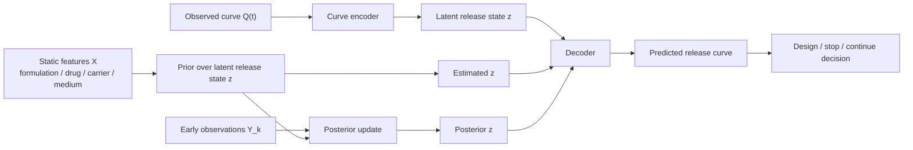
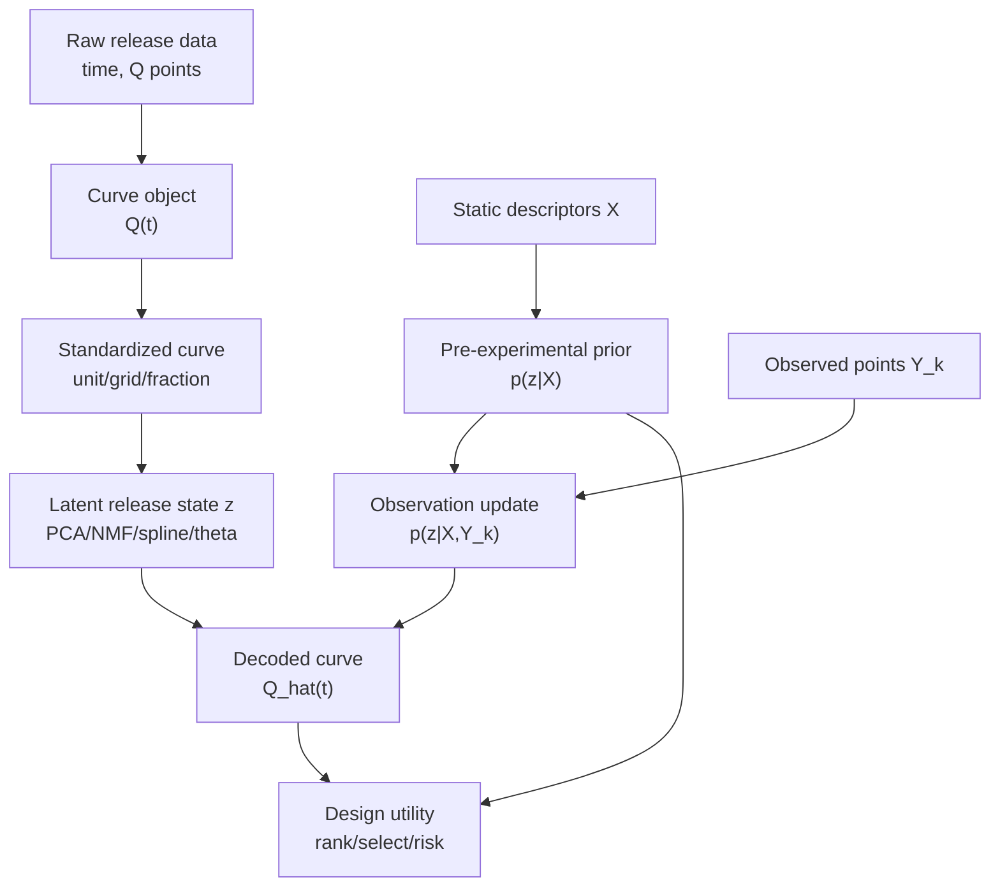

# 统一药物释放 ML：问题与解决方案整理

Date: 2026-06-12

这份文档整理当前讨论中用户提出的核心问题，以及对应的研究路线和解决方案。它不是实验流水账，而是项目接下来应该遵守的研究框架。

## 总目标

本项目不应该只是为某一个体系训练一个更高 RMSE 排名的模型，而是要建立药物释放领域的统一 ML 卡尺：

```text
静态处方 / 实验条件
    -> release prior
观测到的释放点
    -> release posterior
latent release state
    -> curve prediction / experiment decision
```

真正目标是统一评估：

1. 实验前能不能指导处方和条件设计；
2. 实验中早期观测能不能识别释放状态；
3. 模型能不能服务实验决策，而不只是拟合曲线。

## 当前核心矛盾

### 问题 1：不能只依赖早期观测

用户指出：

```text
如果模型必须等实验做几天、有早期释放点后才能预测后期，
那它最多是实验监控工具，不是实验设计工具。
```

这个判断是对的。

早期观测路线的价值是：

```text
少测点
早点停
判断失败
修正后期预测
```

但它不能完全替代实验前设计能力。实验前仍然需要：

```text
static features -> release prior
```

也就是在还没有释放曲线时，模型至少要能给出粗粒度方向：

```text
哪个处方更可能慢释？
哪个条件更可能 burst？
哪个候选值得优先实验？
哪个候选不确定性太高，需要先测？
```

### 解决方案

把任务拆成三层，而不是只做 RMSE：

| 层级 | 输入 | 输出 | 作用 |
|---|---|---|---|
| 实验前 prior | static formulation / assay features | release prior over latent state | 指导候选设计和初筛 |
| 实验中 posterior | static features + early observations | updated release state | 修正预测、减少观测成本 |
| 决策效用 | release state + target profile | selection / stopping / risk | 服务真实实验决策 |

## 问题 2：静态特征无法完整预测曲线，但不等于没有设计价值

用户担心：

```text
如果静态特征不能准确预测曲线，那模型就不能指导实验。
```

需要区分两个目标：

```text
目标 A：静态特征精确预测整条曲线
目标 B：静态特征改变实验选择决策
```

目前 PLGA 和 liposome 结果都说明：

```text
static features -> exact Q(t)
```

通常不够。

但这不等于：

```text
static features -> useful release prior
```

也不够。

### 解决方案

设计 `Design Utility Benchmark`，不要只看曲线 RMSE。

给定目标释放窗口，例如：

```text
24 h release < 30%
7 d release between 60% and 80%
30 d release > 90%
```

评价模型能否在实验前选出更好的候选：

| 指标 | 含义 |
|---|---|
| top-k hit rate | 推荐的前 k 个候选中有多少达到目标 |
| regret | 推荐候选与最优候选的差距 |
| target-window success rate | 是否落入目标释放窗口 |
| risk / burst failure rate | 是否避开明显失败曲线 |
| uncertainty calibration | 高不确定性是否对应高失败率 |

这样即使静态曲线 RMSE 不完美，也能回答：

```text
静态特征是否能指导实验初筛？
```

## 问题 3：二维点数据让建模对象变形

用户指出：

```text
现在的 time, Q 二维点数据让人不舒服。
```

这个不舒服是对的。`time, Q` 是存储格式，不应该是核心建模单位。

真正的样本应该是：

```text
一个 formulation / condition -> 一条 release function Q(t)
```

而不是：

```text
一个 timepoint -> 一个训练样本
```

否则会导致：

1. 同一曲线的点被拆散；
2. 模型误以为点之间独立；
3. 单调性、饱和性、时间尺度等曲线结构丢失；
4. 不同药物释放体系之间无法统一。

### 解决方案

把药物释放对象分成四层标签：

| 层级 | 名称 | 内容 |
|---|---|---|
| Level 0 | raw curve | 原始 Q(t)、原始时间单位、source 信息 |
| Level 1 | standardized curve | 统一单位、cumulative release fraction、统一 grid |
| Level 2 | latent release state | curve dictionary coefficients / theta / spline coefficients |
| Level 3 | decision labels | slow/fast、burst risk、target success、stop/continue |

核心统一标签不应该只是：

```text
slow / medium / fast
```

而应该是：

```text
curve -> latent release state z
```

`slow / medium / fast` 只是 `z` 的粗分类。

## 问题 4：是不是每个体系都要重新训练一次？

用户担心：

```text
如果每个体系都重新训练一个模型，就不是统一药物释放 ML。
```

这也对。

严谨评估时，每个 fold 必须重新训练：

```text
train fold 学 dictionary / predictor
test fold 只评估
```

这是为了防泄露。

但部署和长期目标不应该是：

```text
每来一个体系都从零训练一个模型
```

而应该是：

```text
共享一个 release curve language / decoder
不同体系只学习映射、校准或 posterior update
```

### 解决方案

统一目标从“统一预测器”改成“统一表示 + 统一任务”：

```text
Q(t) -> z
z -> Q(t)
X -> prior over z
X + observations -> posterior over z
z -> decision
```

其中：

| 符号 | 含义 |
|---|---|
| `X` | 静态处方、药物、载体、介质和实验条件 |
| `Q(t)` | 释放曲线函数 |
| `z` | latent release state / curve-language coefficients |
| `Y_k` | k 个观测释放点 |

## 问题 5：这是不是世界模型？

用户指出：

```text
曲线字典和 latent state 实际上像世界模型。
```

判断：是的，但它是最小形态的 release world model，不是 foundation model。

当前 114 已经证明：

```text
Q(t) -> z -> Q(t)
```

是成立的。

证据：

```text
oracle PCA dictionary reconstruction RMSE:
group_by_API            ~1.55 percentage points
group_by_release_method ~1.55 percentage points
stratified_5fold        ~1.20 percentage points
```

这说明：

```text
release curves have a compact curve language.
```

但现在还没有证明：

```text
X -> z
X + Y_k -> z
```

能完全成立。

所以现在的世界模型结构是：



## 问题 6：不能继续简单堆神经网络

用户指出：

```text
简单神经网络之前试过，不能再无意义拉回来。
```

判断：正确。

现在瓶颈不是函数逼近能力，而是：

```text
static features X 是否包含足够信息来识别 latent state z
```

如果 `X` 本身缺信息，MLP / KAN / LNN / MoE 不会凭空补出来，只会更容易过拟合 source、API、assay method 的偶然相关。

### 解决方案

在以下诊断完成前，暂时不做 generic MLP / LNN / KAN / MoE：

1. `oracle z -> curve` ceiling；
2. `static X -> z` gap；
3. `static X + k observations -> z` gap closure；
4. dictionary stability；
5. feature-to-z 可解释性；
6. design utility benchmark。

允许做的是小参数、可解释的映射：

```text
Ridge / ExtraTrees coefficient model
metric-learned prototype gating
regularized feature-to-z mapping
uncertainty-aware prior
```

## 问题 7：RDKit 或仿真描述符能不能加入？

用户提出：

```text
能不能加入类似 RDKit 的仿真或分子描述符？
```

答案：可以，而且应该做，但位置要正确。

RDKit 不能直接仿真释放曲线。它的作用是补 `X`：

```text
X = formulation / drug / carrier / medium descriptors
```

当前静态特征太粗，例如：

```text
API_name
Drug_Mw
polymer/lipid name
pH / temperature
particle size
```

这些可能不足以预测 `z`。

RDKit 能补：

| 类型 | 示例 |
|---|---|
| 分子尺寸 | MolWt, exact mass |
| 极性 | TPSA |
| 疏水性 | LogP |
| 氢键 | HBD, HBA |
| 构象 | rotatable bonds |
| 芳香性 | aromatic rings |
| 指纹 | Morgan fingerprints |
| 电荷/离子化 proxy | pH-pKa related proxies if pKa available |

更重要的是构造 interaction features：

```text
drug_logP - carrier_hydrophobicity
pH - drug_pKa
drug_TPSA / carrier polarity
drug_charge_at_pH
drug HBD/HBA vs carrier interaction capacity
```

### 解决方案

RDKit 应该作为 `X enrichment` 实验：

```text
baseline X -> z
baseline X + RDKit descriptors -> z
baseline X + interaction descriptors -> z
```

评价：

```text
coefficient error
curve RMSE
design utility
strict group split
```

如果有提升，说明实验前设计能力可以通过更好的分子/相互作用描述符增强。

如果没有提升，说明缺失信息可能主要来自：

```text
microstructure
manufacturing process
batch effects
polymer/lipid morphology
assay hidden variables
```

## 当前证据链

### PLGA

当前 PLGA 路线已经支持：

```text
static descriptors under-identify release;
early observations expose missing release state;
future prediction is an information-budget problem.
```

但 PLGA 也暴露了问题：

```text
如果只依靠 early observations，
实验前设计能力仍然不足。
```

### Liposome

Yanes et al. 的公开论文和代码提供了第二体系 scaffold：

```text
static 7 features -> slow / medium / fast kinetic class
```

但他们没有做：

```text
continuous future curve prediction
early observation forecasting
design utility benchmark
latent state gap analysis
```

本项目已完成的 liposome 证据：

| 脚本 | 结论 |
|---|---|
| `111` | 作者 baseline 是 kinetic-class classification，不是曲线预测 |
| `112` | 3-class kinetic middle layer 有信号，但太粗 |
| `113` | theta/prototype mixture 比 global 好，early Q 改善 routing，但严格 split 不赢 early-only |
| `114` | curve dictionary 很强，static-to-coefficients 部分成功，仍有 oracle gap |

114 的关键数字：

```text
oracle_pca_reconstruct_c8:
group_by_API            RMSE 1.547
group_by_release_method RMSE 1.547
stratified_5fold        RMSE 1.197

best static-to-coefficients:
group_by_API            RMSE 15.892
group_by_release_method RMSE 13.983
stratified_5fold        RMSE 9.578
```

解释：

```text
curve language exists;
static features predict part of that language;
missing latent state remains large.
```

## 统一框架

项目应从“预测曲线”升级成“释放状态辨识与实验决策”。



## 下一步实验路线

### 115：Latent Gap / Observation-Budget

目标：

```text
验证早期观测是否关闭 static-to-z 和 oracle-z 之间的 gap。
```

实验：

```text
k = 0, 1, 2, 3, 5

static X -> z
static X + Y_k -> z
oracle full curve -> z
```

指标：

```text
z_error
curve_RMSE
oracle_gap_closed %
uncertainty contraction
```

### 116：Design Utility Benchmark

目标：

```text
验证 static prior 是否能指导实验前候选选择。
```

任务：

```text
给定目标释放窗口，模型只能看 static features，
选择 top-k 候选。
```

指标：

```text
top-k hit rate
regret
target success rate
burst failure avoidance
uncertainty calibration
```

### 117：Descriptor Enrichment / RDKit

目标：

```text
验证静态特征失败是否因为缺少分子和相互作用信息。
```

实验：

```text
baseline static X
baseline X + RDKit descriptors
baseline X + interaction features
```

评价：

```text
X -> z 是否提升
design utility 是否提升
strict transfer 是否提升
```

## 当前结论

项目目前不应该继续定义为：

```text
寻找一个直接预测 release curve 的最强算法。
```

应该定义为：

```text
建立一个统一药物释放 ML 卡尺，
评估 static descriptors、molecular descriptors、early observations
分别能在多大程度上识别 latent release state，
并最终服务实验设计与观测决策。
```

最核心的一句话：

```text
Drug release prediction is not just curve regression;
it is release-state inference under limited pre-experimental descriptors
and costly observations.
```
